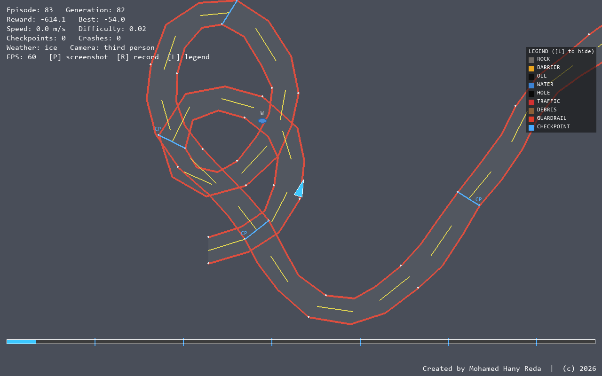
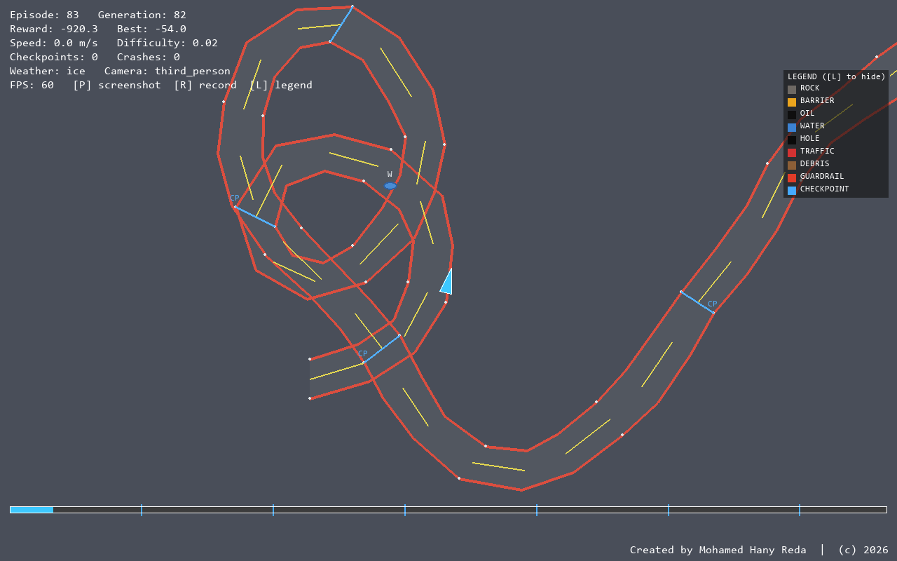

<div align="center">

# 🏁 AI Evolution Racing Lab

### A Self-Evolving Reinforcement Learning Racing Simulation

**Procedural Worlds · Reinforcement Learning · Explainable AI · Adaptive Difficulty · AI Research Analytics**

<br>


<br>

> Two AI systems create and learn. A third analyzes their behavior. Together, they generate racing worlds, train autonomous drivers, explain decisions, and evolve across generations.

</div>

---
## 🖼️ Project Preview

<div align="center">





<br><br>

*Live AI Racing Simulation*   •   *Evolution Analytics & Explainable AI*

</div>


## 🎥 Project Concept

**AI Evolution Racing Lab** is a self-evolving racing simulation with no human player.

The project connects three specialized AI systems in a continuous learning loop:

```text
World Architect
      │
      ▼
Generates a Track + Weather
      │
      ▼
RL Driver Trains and Races
      │
      ▼
Research Analyst Evaluates Results
      │
      ▼
World Difficulty and Biome Memory Update
      │
      └───────────────↺
```

The goal is not simply to train an AI car to complete a track. The system investigates how multiple AI components can interact to create an evolving environment where:

* The world adapts to the driver's weaknesses.
* The driver learns from increasingly challenging conditions.
* A research agent explains performance and identifies recurring patterns.
* Every generation is recorded and can be analyzed or reproduced.

---

# 🤖 The Three AI Systems

## 🌍 Agent A — World Architect

The **World Architect** generates and adapts racing environments.

Capabilities include:

* Procedural track generation
* 15 environmental biomes
* Adaptive difficulty
* Terrain variation
* Track curvature
* Elevation changes
* Obstacles
* Dynamic weather
* Per-biome performance memory
* Reproducible Track DNA

The Intelligent World Architect does not only increase global difficulty.

If the Driver repeatedly struggles on ice, the system can increase exposure to ice-related conditions rather than making every part of the environment harder.

---

## 🚗 Agent B — Reinforcement Learning Driver

The Driver learns autonomous racing behavior using configurable reinforcement-learning algorithms:

* PPO
* SAC
* A2C

The Driver can be trained with six personality profiles:

| Personality  | Driving Behavior                              |
| ------------ | --------------------------------------------- |
| Aggressive   | Higher speed and stronger overtaking behavior |
| Professional | Controlled and efficient racing               |
| Defensive    | Prioritizes safety and consistency            |
| Risky        | Accepts greater danger for potential rewards  |
| Balanced     | Combines speed and safety                     |
| Experimental | Encourages exploration and unusual strategies |

Personality profiles reshape reward priorities and produce different driving behaviors without changing the underlying simulation.

---

## 🔬 Agent C — Research Analyst

The **Research Analyst** observes every race and produces data-grounded explanations.

It can:

* Explain success and failure
* Detect recurring driving mistakes
* Identify genuine improvements
* Analyze crashes
* Track long-term performance
* Suggest adjustments to the Driver
* Suggest changes to the World Architect

The Analyst uses actual race telemetry and logged outcomes rather than generating decorative commentary.

---

# 🧬 Self-Evolution Loop

```text
1. World Architect selects difficulty and biome bias
                    ↓
2. Track DNA and weather are generated
                    ↓
3. RL Driver trains or races
                    ↓
4. Race telemetry is recorded
                    ↓
5. Research Analyst evaluates performance
                    ↓
6. Achievements and AI conversations are generated
                    ↓
7. World Architect updates difficulty and biome memory
                    ↓
8. The next generation begins
```

This creates a persistent AI ecosystem in which the environment and the learning agent continuously influence one another.

---

# ✨ Key Capabilities

| Area                   | Features                                                  |
| ---------------------- | --------------------------------------------------------- |
| Procedural Worlds      | 15 biomes, terrain, curvature, elevation, obstacles       |
| Reproducibility        | Track DNA with exact seeded regeneration                  |
| Reinforcement Learning | PPO, SAC, and A2C                                         |
| Adaptive Difficulty    | Performance-driven world evolution                        |
| Biome Intelligence     | Per-biome performance memory                              |
| Dynamic Weather        | Rain, storms, fog, snow, ice, and wind                    |
| Vehicle Physics        | Engine force, braking, drag, grip, weight transfer        |
| Explainable AI         | Decision rationale, confidence, and input saliency        |
| AI Introspection       | Live neural activation visualization                      |
| Evolution Tracking     | Generation history and exact world reconstruction         |
| AI Competition         | Checkpoint tournaments and rankings                       |
| Research Analytics     | Charts, heatmaps, racing lines, and PDF reports           |
| Persistent Data        | SQLite race, model, world, and report history             |
| Presentation           | Live renderer, HUD, weather effects, and camera direction |

---

# 🧠 Explainable AI

The project provides multiple ways to inspect the Driver's behavior.

## Decision Rationale

The system translates driving behavior into plain-language explanations.

Example:

```text
Approaching a sharp corner.

Decision:
Reducing acceleration and applying controlled braking
because the front distance sensor indicates limited space.

Confidence: 87%
```

## Policy Confidence

Confidence is derived from the policy's action-distribution entropy rather than a manually invented score.

## Input Saliency

Input-gradient analysis estimates which observations had the strongest influence on the current decision.

Examples include:

* Front distance sensor
* Side obstacle distance
* Vehicle speed
* Track direction
* Weather conditions

## AI Brain Visualization

The system captures real activations from the live policy network using forward hooks and displays per-layer activation information.

---

# 🌦️ Dynamic Racing Environments

The World Architect can generate tracks across multiple biome types with different physical and visual conditions.

Environmental factors include:

* Surface grip
* Terrain behavior
* Obstacles
* Curvature
* Elevation
* Weather
* Visibility
* Wind

Weather can change during a race and directly affect:

* Tire grip
* Vehicle handling
* Sensor visibility
* Racing strategy

---

# 🧪 Vehicle Simulation

The simulation includes:

* Engine force
* Braking force
* Aerodynamic drag
* Terrain-dependent grip
* Weight transfer
* Lateral slip
* Distance sensors
* Reward shaping

The environment is exposed through **Gymnasium**, allowing the Driver to interact with the racing world using a standard reinforcement-learning interface.

---

# 🏆 Evolution & Competition

## Evolution Timeline

The system records:

* Generation number
* Difficulty
* Reward
* Success rate
* Crash rate
* Driver performance

Any saved generation can be revisited using its recorded world configuration.

## AI Tournament

Saved model checkpoints can compete on identical seeded tracks.

Supported formats:

* Single elimination
* Round robin

This makes it possible to compare learned policies under controlled conditions.

## Hall of Fame

The Hall of Fame records achievements such as:

* Fastest finish
* Highest reward
* Longest clean streak
* Lowest crash rate

## AI Achievements

The project includes rule-based achievements derived from actual race history.

Examples:

* First Clean Race
* Perfect Lap
* Master Driver
* Elite Cornering

---

# 📊 Analytics & Research

The analytics system generates:

* Reward evolution charts
* Success-rate charts
* Crash-rate charts
* Difficulty progression
* Crash-location heatmaps
* Braking-intensity heatmaps
* Steering-intensity heatmaps
* Average-speed heatmaps
* Successful racing-line overlays

All visualizations are generated from real per-step race telemetry.

---

# 📄 Automated Research Reports

The project can generate a multi-page PDF research report containing:

* Performance charts
* Evolution history
* Spatial heatmaps
* Racing lines
* Hall of Fame statistics
* Recent Research Analyst findings

This turns simulation results into a structured research artifact.

---

# 🎬 Live Visualization

The Pygame presentation layer includes:

* Top-down racing view
* Road surfaces
* Guardrails
* Checkpoint gates
* Finish-line indicators
* Obstacle icons
* Progress tracking
* Weather overlays
* Live HUD
* Explainable-AI subtitles

The system also includes a rule-based **Cinematic Camera Director**.

Camera behavior adapts to race context:

* Wide view on long straights
* Close driving view in tight corners
* Slow-motion crash replay
* Finish-line framing

---

# 📸 Recording & Screenshots

During live simulation:

| Key         | Action                      |
| ----------- | --------------------------- |
| `1 / 2 / 3` | Switch camera mode          |
| `L`         | Show or hide the legend     |
| `P`         | Save a screenshot           |
| `R`         | Start or stop MP4 recording |
| `Esc`       | Exit                        |

Generated media is stored in:

```text
data/media/
├── screenshots/
└── videos/
```

---

# 🛠️ Technology Stack

| Area                   | Technologies              |
| ---------------------- | ------------------------- |
| Language               | Python                    |
| Reinforcement Learning | Stable-Baselines3         |
| Algorithms             | PPO, SAC, A2C             |
| Deep Learning          | PyTorch                   |
| Simulation Interface   | Gymnasium                 |
| Procedural Generation  | Custom Track DNA System   |
| Physics                | Custom Vehicle Dynamics   |
| Database               | SQLite                    |
| Visualization          | Pygame                    |
| Analytics              | Python Data Visualization |
| Reporting              | Automated PDF Generation  |
| CLI                    | Typer                     |
| Testing                | Pytest                    |

---

# 📁 Project Structure

```text
ai-evolution-racing-lab/
│
├── main.py
├── config/
│   └── config.yaml
│
├── src/
│   ├── simulation/
│   │   ├── track_generator.py
│   │   ├── track_dna.py
│   │   ├── weather.py
│   │   ├── physics.py
│   │   └── env.py
│   │
│   ├── ai/
│   │   ├── world_architect.py
│   │   ├── driver_agent.py
│   │   ├── research_analyst.py
│   │   ├── personalities.py
│   │   ├── explainable.py
│   │   ├── brain_visualizer.py
│   │   ├── achievements.py
│   │   └── conversations.py
│   │
│   ├── analytics/
│   ├── tournament/
│   ├── reports/
│   ├── rendering/
│   ├── training/
│   └── database/
│
├── docs/
├── tests/
└── data/
```

---

# 🚀 Quick Start

## Installation

```bash
pip install -r requirements.txt
```

Python **3.10+** is required.

## Train the Self-Evolution System

```bash
python main.py train \
    --episodes 2000 \
    --personality professional
```

## Watch a Trained Driver

```bash
python main.py play \
    --model data/models/best_model
```

## Run a Research Benchmark

```bash
python main.py research --n 1000
```

## Inspect the AI Systems

```bash
python main.py analyze
python main.py timeline
python main.py hall-of-fame
python main.py achievements
python main.py conversations
```

## Generate a Research Report

```bash
python main.py report
```

## Run an AI Tournament

```bash
python main.py tournament \
    --models data/models/best_model.zip,data/models/latest_model.zip \
    --format round_robin
```

## Run Tests

```bash
pytest tests/
```

---

# 📌 Project Status

| Component                       | Status        |
| ------------------------------- | ------------- |
| Procedural Track Generation     | ✅ Implemented |
| Track DNA Reproduction          | ✅ Implemented |
| Adaptive World Architect        | ✅ Implemented |
| Intelligent Biome Memory        | ✅ Implemented |
| PPO / SAC / A2C Driver          | ✅ Implemented |
| Driver Personalities            | ✅ Implemented |
| Dynamic Weather                 | ✅ Implemented |
| Research Analyst                | ✅ Implemented |
| Explainable AI                  | ✅ Implemented |
| Policy Activation Visualization | ✅ Implemented |
| Evolution Timeline              | ✅ Implemented |
| AI Tournament                   | ✅ Implemented |
| Hall of Fame                    | ✅ Implemented |
| Achievement System              | ✅ Implemented |
| AI Conversations                | ✅ Implemented |
| Heatmaps & Racing Lines         | ✅ Implemented |
| Automated PDF Reports           | ✅ Implemented |
| Live Rendering                  | ✅ Implemented |
| Cinematic Camera Director       | ✅ Implemented |
| Automated Social Content        | ⏳ Deferred    |

---

# 🔒 Portfolio Showcase

This repository presents the architecture, capabilities, and engineering approach behind **AI Evolution Racing Lab**.

The project is provided as a portfolio and technical showcase. Some implementation details, trained models, generated datasets, and internal development assets may remain private.

For a technical walkthrough, demonstration, research collaboration, or engineering opportunity, please contact the author.

---

# 👨‍💻 Author

**Mohamed Hany Reda**

Senior AI & Software Engineer · Game Developer · Artificial Intelligence Engineer

**Focus Areas**

Reinforcement Learning · Game AI · Procedural Generation · Explainable AI · Simulation · Autonomous Systems

---

# 📄 License

© 2026 Mohamed Hany Reda — All Rights Reserved.

This project is provided for portfolio and evaluation purposes. The source code and project assets may not be copied, redistributed, or used commercially without permission.

---

<div align="center">

## 🏁 AI Evolution Racing Lab

**World Generation · Reinforcement Learning · Explainable AI · Continuous Evolution**

Built by **Mohamed Hany Reda**

</div>
